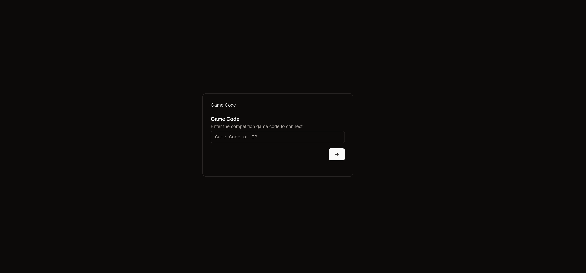
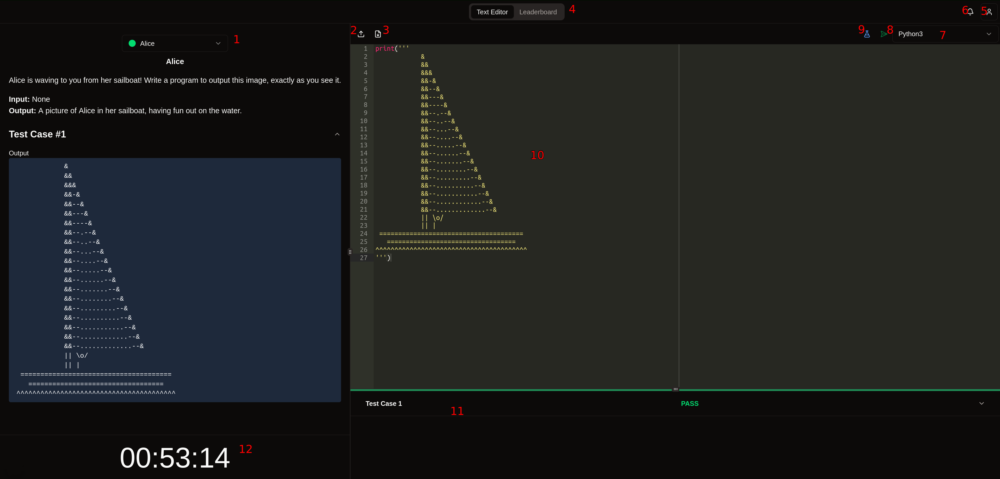

# Competing in a Competition
Competing in a basalt hosted competition is very simple, requiring you to only install the application and connect to the same network as the server.

# Running Basalt
Basalt can be used as a web client, or an application. After accessing or running Basalt, you should see a page requesting a game code or IP address. This should look like:



* **Note:** It is recommended that you install and run the application before your competition as to avoid any issues during the event.

## Web Client
To use the basalt webclient, enter the server IP address and port number into a browser of your preference. The url is comprised of two parts, the IP address of the server and the port serving the web client. Below is an example of how the url is structured and should be entered into your search bar.
```
http://127.0.0.1:8517
```

* **Note:** The IP address and port number of the server will typically be provided by the host during the event.

## Desktop Application
To install the Basalt Desktop Application, simply download the install package for your operating system, and run it! This should add Basalt onto your computer for launch.

### GitHub Install
If install packages are unavailable, you can also download the source code directly from the [Basalt](https://github.com/basalt-rs/basalt) repository! This requires internet access, so if access to the internet is restricted, you will need to connect to a network with internet access to proceed.

To obtain the source code, clone the repository by running this command in your terminal:
```shell
git clone https://github.com/basalt-rs/basalt
```
* **Note:** If you had to disconnect from the server due to restricted internet access, you are now safe to reconnect as the rest of these steps do not require internet access.

After the download is complete, install *node_modules* by running the following commands.
```shell
cd ./basalt/client
npm i
```
Finally, you can run the desktop application or web client using these commands listed below.

**Desktop Application:**
```shell
cargo tauri dev
```
**Web Client:**
```shell
npm run dev
```

# Competing
Now you are ready to compete! Your game code and login credentials will be provided by the host, so sit tight until you have those in hand.

Once you're logged in and the competition has started, you have serveral abilities as a competitor.


1. View question details, visible test cases, and see the current state of the question. Questions can be green for passed, red for failed, blue for in-progress, and grey for unattempted.
2. Upload code to be put into the text editor.
3. Download question packet in PDF format.
4. Switch between the Text Editor and Leaderboard.
5. Access the user menu, which enables you to view your current team, manage your app theme, personalize your text editor, and logout.
6. View announcement history.
7. Specify a programming language. By clicking this button, you can set the language you are writing in, which also affects your tests, submissions, and the text editor's syntax highlighting.
8. Send submissions. Submissions run your code through a large number of test cases, some of which are not visible to you. These count to your overall score and will mark your question as either failed or passed.
9. Submit tests. Tests allow you to run your code through a small suite of visible test cases and view the results of your code. These do NOT count towards your score and will mark your question as in-progress.
10. Write and edit code. This is your text editor, here you will write your code.
11. View test results. Here, visible test cases will be displayed with information regarding any errors that may have occured while running your code during that particular test. Additionally, a progress bar can be seen at the top, indicating the pass rate of your last submission.
12. View time remaining. This is a quick way to gauge how much time is left and practice some time management skills.
