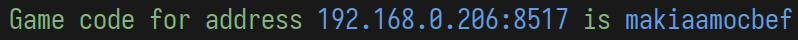

# Connecting to a competition

When the basalt application opens, you will be prompted for a game code
or IPv4 address.  This is how the application knows how to connect to
the competition.

You can get your ip address and game code using the following command if
you have the [Basalt CLI](https://github.com/basalt-rs/basalt-cli)
installed:

```sh
basalt game-code -c <path-to-config>
```

which will output something like



You may enter either blue section as the game code when connecting to
your server.
