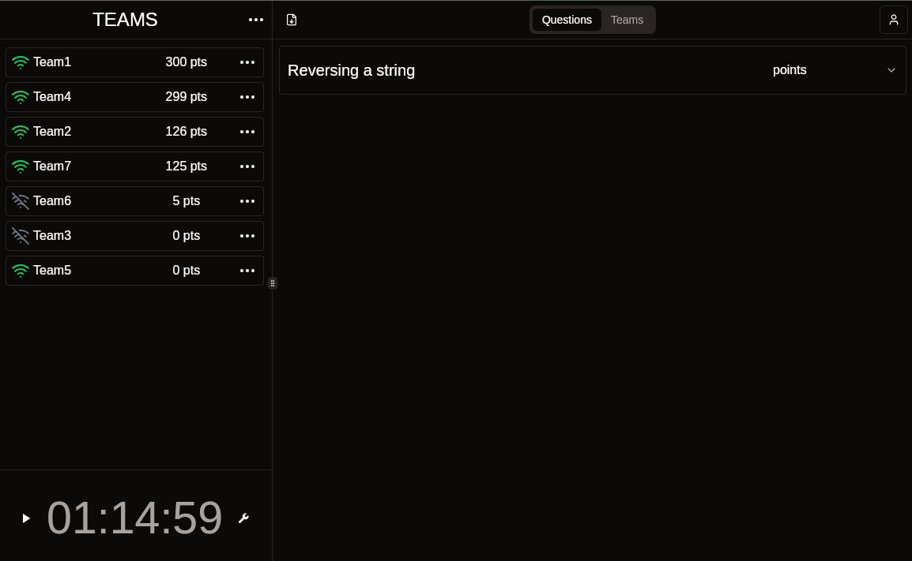

# Hosting a competition

To host a competition, you'll want to install the [Basalt CLI](../../cli/index.md).
Next, you'll want to create a [Config](../../config/index.md) which includes
server and competition configurations as well as all the questions in your packet.

When you have a configuration you're happy with, you can use the Basalt CLI to generate
a [Docker](https://docs.docker.com/get-started/get-docker/) image that you can spin up
like so:

```bash
basalt-cli build <config.toml>
```

Your docker images will be set up with the environment specified in your
setup and init scripts if you provided them. If you simply provided a list of recognized
languages, then it will perform all of the necessary setup at this build time.


# Managing Your Competition

As a host, you'll have access to controls which allow you to pause and start the event.
Note that the server will start in the paused state waiting for you to start it manually.
Competitors cannot perform any actions after logging in until you start the event.



If you pause the competition while it's running, all competitors will be instantly halted.
Competitors will instantly resume competing as soon as you unpause the competition.

You can unpause the competition using the pause button to the left of the countdown. You
can unpause the competition using the play button in the same location.
